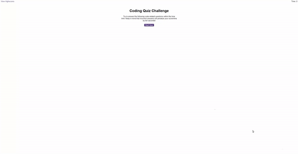

# quiz-game

## Description

The goal of this project was to build a quiz with web APIs and manipulating HTML elements to create a reactive experience.

## Installation & Usage

Use the deployed link given.

Repo link: https://github.com/YusufMbk/quiz-game/edit/main/README.md

Deployed link: https://yusufmbk.github.io/quiz-game

## License

This project is licensed under MIT.

## Contributing

You can contribute by creating a pull request.

